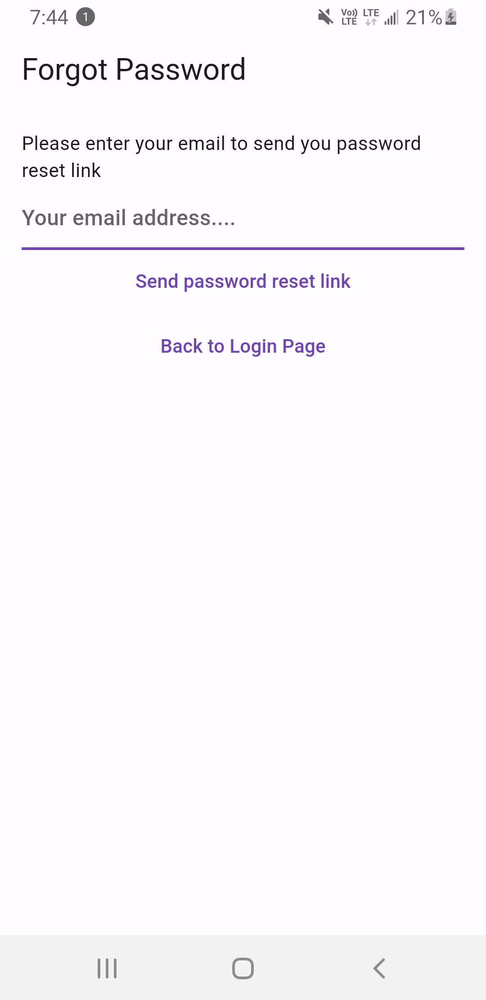

# Notes Application

 A user-friendly notes application that seamlessly integrates with Gmail, allowing users to sign in with their Gmail accounts. This application will empower users to efficiently manage, edit, and share their notes, all while ensuring a secure and personalized experience

 

# Materials Used
This project is done by using Flutter and Firebase

